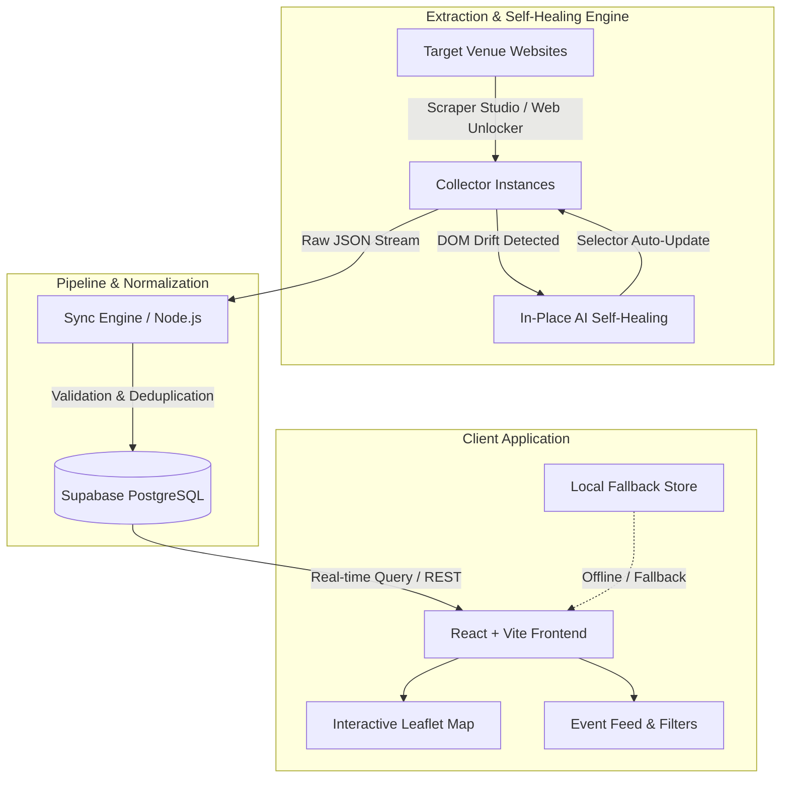

# EXTRACTLY

> **Intelligent, Self-Healing Cultural Event Aggregator & Live Discovery Platform**

EXTRACTLY is a robust, end-to-end event extraction and discovery platform designed for independent cultural and performing arts venues. It combines resilient, AI-assisted web scraping capabilities with automated data normalization, real-time database synchronization, and an interactive geographic discovery interface.

---

## 🌟 Key Features

- 🤖 **Self-Healing Web Extraction**: Dynamically adapts to DOM layout shifts, class renames, and structural changes without breaking collector schemas or client integrations.
- 🔄 **Automated Pipeline & Sync Engine**: Handles extraction polling, data sanitization, schema normalization, and deduplicated upserts into PostgreSQL via Supabase.
- 🗺️ **Interactive Map & Discovery UI**: Live venue mapping powered by Leaflet, complete with geolocation markers, custom venue cards, and synchronized list-to-map interactions.
- 🎯 **Multi-Dimensional Filtering**: Real-time full-text search, date segmentation (Today, Tomorrow, This Weekend, All Upcoming), and category filtering (Comedy, Theatre, Music, Literature, Visual Art).
- 🛡️ **Zero-Crash Resilient Architecture**: Graceful fallback mechanisms ensuring full UI rendering and offline usability even in low-connectivity or unconfigured states.
- 🎨 **Editorial Aesthetic & Modern Design System**: Refined visual identity built with Tailwind CSS, featuring bespoke typography (Fraunces serif & Inter sans), smooth micro-interactions, and responsive layouts.

---

## 🏗️ System Architecture



---

## 💻 Tech Stack

| Layer | Technologies |
| :--- | :--- |
| **Frontend Framework** | React 19, Vite, JavaScript (ES modules) |
| **Styling & Design** | Tailwind CSS, PostCSS, Autoprefixer, Google Fonts (*Fraunces* & *Inter*) |
| **Mapping & Geospatial** | Leaflet, React integration |
| **Backend & Storage** | Supabase (PostgreSQL), SQL Schema Migrations |
| **Data Ingestion** | Node.js, Bright Data CLI / Scraper Studio, REST API |
| **Deployment** | Vercel (Frontend), Supabase Cloud (Database) |

---

## 📁 Repository Structure

```
.
├── frontend/                       # Client web application
│   ├── public/                     # Static assets & fallback mock data
│   ├── src/
│   │   ├── components/             # EventCard, EventList, DateFilter, MapView
│   │   ├── data/                   # Default datasets & mock fallbacks
│   │   ├── lib/                    # Supabase client & category definitions
│   │   ├── App.jsx                 # Main application state & UI coordinator
│   │   ├── index.css               # Base Tailwind stylesheets & typography
│   │   └── main.jsx                # React root mount point
│   ├── package.json                # Frontend dependencies & scripts
│   ├── tailwind.config.js          # Tailwind CSS theme configuration
│   └── vite.config.js              # Vite build configuration
├── pipeline/                       # Ingestion & synchronization scripts
│   ├── sync.js                     # End-to-end collector trigger & Supabase upsert
│   ├── seed.js                     # Test dataset seeder
│   ├── cleanup-seed.js             # Seed database reset utility
│   ├── schema.sql                  # PostgreSQL database table definitions
│   └── package.json                # Pipeline dependencies
├── scraper/                        # Scraper management & testbed
│   ├── COMMANDS.md                 # Collector operations & execution logs
│   └── self-heal-demo/             # Simulated venue DOM environment for healing tests
│       └── test-venue.html         # Test fixture for layout drift validation
└── docs/                           # Sample datasets & extraction artifacts
    ├── all-venues-final.json       # Consolidated clean extraction payload
    ├── habitat-final.json          # Venue extraction sample: Indie Habitat
    ├── royal-opera-house-final.json# Venue extraction sample: Royal Opera House
    ├── self-heal-before.json       # Pre-healing extraction payload (schema mismatch)
    └── self-heal-after.json        # Post-healing extraction payload (restored output)
```

---

## 🚀 Getting Started

### Prerequisites

- **Node.js**: v18.0.0 or higher
- **npm** or **yarn** / **pnpm**
- *(Optional)* Supabase account & Bright Data credentials for live pipeline sync

---

### 1. Clone the Repository

```bash
git clone https://github.com/Chaitanya-2006/self-heal-demo.git
cd self-heal-demo
```

---

### 2. Frontend Setup & Local Development

```bash
cd frontend
npm install
```

#### Configure Environment Variables

Create a `.env` file inside the `frontend/` directory (refer to `.env.example`):

```env
VITE_SUPABASE_URL=https://your-project.supabase.co
VITE_SUPABASE_ANON_KEY=your-supabase-anon-key
```

> **Note**: If environment variables are omitted, the frontend automatically falls back to curated offline datasets, allowing complete local development without third-party dependencies.

#### Run Dev Server

```bash
npm run dev
```

Open `http://localhost:5173` in your browser.

#### Build for Production

```bash
npm run build
```

---

### 3. Pipeline & Synchronization Setup

The pipeline coordinates triggering remote collectors, retrieving extracted batches, and performing deduplicated upserts into PostgreSQL.

```bash
cd ../pipeline
npm install
```

#### Configure Pipeline Environment

Set the required environment variables in a `.env` file within `pipeline/`:

```env
SUPABASE_URL=https://your-project.supabase.co
SUPABASE_SERVICE_ROLE_KEY=your-service-role-or-anon-key
BRIGHTDATA_API_KEY=your-brightdata-api-key
COLLECTOR_ID_HABITAT=your-collector-id
COLLECTOR_ID_OPERA_HOUSE=your-collector-id
```

#### Run Database Migration

Apply the SQL schema in `pipeline/schema.sql` within your Supabase SQL editor:

```sql
CREATE TABLE IF NOT EXISTS events (
  id UUID DEFAULT gen_random_uuid() PRIMARY KEY,
  event_name TEXT NOT NULL,
  event_date DATE NOT NULL,
  event_time TEXT,
  venue_name TEXT NOT NULL,
  venue_address TEXT,
  category TEXT DEFAULT 'Other',
  price TEXT,
  ticket_link TEXT,
  description TEXT,
  image_url TEXT,
  created_at TIMESTAMPTZ DEFAULT NOW(),
  updated_at TIMESTAMPTZ DEFAULT NOW(),
  CONSTRAINT unique_event_per_venue UNIQUE (event_name, venue_name, event_date)
);
```

#### Trigger Ingestion & Sync

```bash
node sync.js
```

---

## ⚙️ Self-Healing Extraction Lifecycle

```
[Target DOM Changes] ──► [Extraction Anomaly] ──► [In-Place Heal] ──► [Diff Approval] ──► [Verified Ingestion]
```

1. **Initial Collector Creation**: Scrapers are provisioned with defined target schemas (`event_name`, `event_date`, `event_time`, `ticket_link`, `venue_name`).
2. **Drift Detection**: When website markup shifts (e.g., class renames, deeper container wrapping, attribute migrations), standard selectors fail or return partial fields.
3. **In-Place Healing**: The AI engine inspects the live page structure, calculates updated CSS/XPath selectors, and patches the scraper without changing the collector endpoint or downstream APIs.
4. **Validation & Sync**: The refreshed scraper re-runs, verifies field completeness, and pipes clean data straight into the live database.

---

## 📊 Data Schema & Normalization

Every extracted event is normalized into a standard event contract:

| Field | Type | Description |
| :--- | :--- | :--- |
| `event_name` | `TEXT` | Title of the performance, play, gig, or exhibition |
| `event_date` | `DATE` | Standardized ISO date (`YYYY-MM-DD`) |
| `event_time` | `TEXT` | Showtime / doors open timing |
| `venue_name` | `TEXT` | Standard venue identifier |
| `category` | `TEXT` | Auto-classified category (*Comedy, Theatre, Music, Visual Art, Literature*) |
| `ticket_link` | `TEXT` | Direct ticketing URL or booking link |
| `description` | `TEXT` | Performance synopsis or artist details |

---

## 🛡️ License

This project is licensed under the [MIT License](LICENSE).
